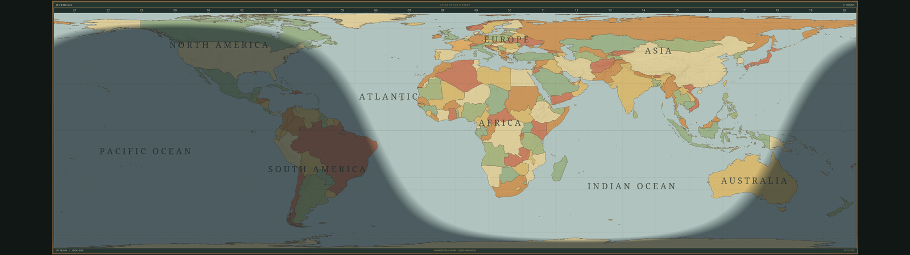

# Meridian

A native, offline vintage world-clock preview for Omarchy / Wayland, inspired
by mechanical boardroom solar clocks. First milestone: standalone preview.
It does **not** currently replace the Omarchy screensaver or lock screen.



## Status

This is an early public-preview candidate. The current release is a standalone
clock that can be launched manually in preview, screensaver, or wallpaper
renderer modes. Omarchy idle integration, true Wayland background layering,
and initial multi-monitor layer-shell launch are implemented behind the
optional `--wallpaper-layer` build; Omarchy idle integration, suspend/resume,
and lock-screen handoff remain planned follow-up work.

The companion static Omarchy theme is published at
[daveplatt71/meridian-theme](https://github.com/daveplatt71/meridian-theme).

## Design priority: speed and size

The user's guiding requirement is that Meridian stay fast and small, in keeping
with Omarchy. Treat performance and footprint as acceptance criteria for new
features, not a cleanup step at the end.

- Prefer compact vector/coordinate data and procedural drawing.
- Reuse system Qt libraries for the Omarchy package; report dependencies
  separately from the application payload.
- Keep screenshots, development tools and test binaries out of release packages.
- Keep raster layers deliberately small and preprocess them offline; do not
  download map data at runtime.
- Cache static layers, limit redraws to what changes, and avoid continuous
  animation or background work without a concrete need.
- Measure startup time, package size, memory and idle CPU/GPU use when adding
  significant layers. Record before/after results and resolve regressions before
  accepting the feature. Establish numerical budgets from the measured baseline.

The current Release executable is approximately 1.34 MiB including the
compressed country and relief resources (excluding shared Qt dependencies); this
is not an installer size. The bundled source assets are retained at 1:50m
resolution and downsampled where raster data is used.
Measurement conditions and outstanding checks are in [PERFORMANCE.md](PERFORMANCE.md).

## Build and run

Requires CMake, Ninja, a C++17 compiler, Qt 6.11 or newer (Base, Declarative
and Wayland), and Noto fonts. A fully updated Arch or Omarchy system is the
supported runtime baseline.

```sh
cmake -S . -B build -G Ninja -DCMAKE_BUILD_TYPE=Release
cmake --build build -j 4
ctest --test-dir build --output-on-failure
./build/meridian
./build/meridian --fullscreen
./build/meridian --screensaver
./build/meridian --wallpaper
```

Escape closes the preview or screensaver. `--wallpaper` is currently a
non-focus fullscreen renderer preview; it does not yet install a background
layer or alter Omarchy's desktop configuration. The fullscreen view uses the display's current
logical dimensions; Qt handles the display scale. A thin walnut/brass picture
frame replaces the former side panels. Ultrawide displays use a Lambert
cylindrical equal-area map with mild horizontal expansion; standard displays
retain the 2:1 equirectangular map. This uses more ultrawide canvas while
keeping the complete world visible. Equal-area projection compresses the polar
regions rather than stretching an existing image vertically. The projection
changes automatically on resize.
Multi-monitor automatic launch and the compositor-specific wallpaper adapter
are later integration milestones.

## Arch and Omarchy installation

The supported development path is a native Arch or Omarchy build. The project
includes an Arch package recipe under `packaging/` for local installation:

```sh
cd packaging
makepkg -si
meridian --fullscreen
```

The package installs only the application and its bundled resources. It does
not edit Omarchy configuration, change idle or lock timings, install a system
service, or replace the stock screensaver. Remove it with the normal Arch
package tools.

For a clean source build, follow the CMake commands above. Package and CI
builds use Release mode and run the full test suite before installation.

```sh
./build/meridian --at 2026-06-21T08:24:00Z
QT_QPA_PLATFORM=offscreen QT_QUICK_BACKEND=software QT_QPA_PLATFORMTHEME=basic \
  ./build/meridian --size 5120x1440 --at 2026-09-16T18:00:00Z --snapshot /tmp/meridian.png
```

`--at` requires an explicit timezone. Snapshots are static renders, not
verification of Wayland fullscreen, input, power use or lock behavior.

## The clock

UTC drives the solar calculation; system timezone drives the local clock.
The map band reports **apparent solar hours** by longitude, not civil timezones.
Night begins at the geometric horizon, with a six-degree civil-twilight fade.
The solar coordinates use NOAA/Meeus equations; atmospheric refraction is not
included. The map updates each minute; the text clock updates each second.

Reference: https://gml.noaa.gov/grad/solcalc/calcdetails.html
Map provenance and public-domain terms: [assets/README.md](assets/README.md).
The display includes compact, preprocessed country polygons and a 2048×1024
Natural Earth shaded-relief layer. Both are static; only the solar/night layer
changes with time.

## Remaining milestones

1. Review the native preview's appearance with the user; refine composition.
2. Profile GPU/CPU on the real ultrawide and test fractional scaling, suspend,
   resize, input dismissal, and optional OLED dimming/movement.
3. Build a user-owned Omarchy integration adapter. Preserve normal idle/lock
   timing and distinguish renderer failure from user dismissal. Never modify
   package-owned `/usr/share/omarchy` files.
4. Add per-monitor launch, installer/uninstaller and configuration.

## Known limitations

- The current build is a standalone preview, not an idle screensaver.
- It does not yet launch one surface per monitor.
- It has not yet been validated across AMD, Intel, and NVIDIA hardware or
  across suspend/resume and monitor hotplug events.
- The current performance record uses Qt's offscreen software backend; real
  Wayland GPU and power measurements are still required.

Please report failures with the Omarchy version, CPU, GPU, display layout and
the command that was run. Include terminal output and a screenshot when
possible.

The preview deliberately uses `org.meridian.preview`, not Omarchy's tracked
screensaver identity. No desktop configuration or security policy is changed.

## Layer-shell development status

The repository currently contains an optional, CI-tested Wayland layer-shell
renderer. It is disabled by default. When enabled,
`--wallpaper-layer` creates a real background surface with an empty input
region and renders the Meridian map into it. It binds every initially
advertised `wl_output`, creates one surface per output, handles runtime output
add/remove, and redraws each output when the UTC minute changes. Integer output
scales are applied to physical buffers while QML remains logical. An optional
fractional-scale build uses `wp_viewporter` when the compositor advertises it;
otherwise it falls back to integer scaling. Layer-surface close and logical
resize recovery recreate only the affected output. Suspend/resume remains
pending. It
requires layer-shell v4 and `wl_compositor` v4, and bounds shared-memory frame
allocation. The
layer-shell proof also uses two bounded shared-memory buffers and coalesces
updates while the compositor holds both. The existing
`--wallpaper` mode remains a normal fullscreen renderer preview.

To validate the optional developer feature locally, install
`wayland-scanner`, `wayland-client`, and `wayland-protocols`, then run:

```sh
cmake -S . -B build-layer-shell -G Ninja \
  -DCMAKE_BUILD_TYPE=Release \
  -DMERIDIAN_WITH_LAYER_SHELL=ON
cmake --build build-layer-shell
ctest --test-dir build-layer-shell --output-on-failure
```

To exercise the optional fractional-scale bindings as well, add
`-DMERIDIAN_WITH_FRACTIONAL_SCALE=ON` to the configure command. That requires
the installed staging `fractional-scale-v1` and stable `viewporter` protocol
XML files.

The generated protocol bindings and proof are not included in the default
package. The proof requires a live Wayland session and exits safely if the
compositor lacks layer-shell support.
The implementation plan and safety requirements are in
[docs/LAYER-SHELL.md](docs/LAYER-SHELL.md).

## Agent workflow

Luna implemented the QML presentation under a fixed interface. Astra reviewed
it and the clock backend. Reviews found and prompted fixes for keyboard focus,
ultrawide layout, the solar-hour overlay, and historical-date shading. Final
acceptance also requires real rendered output and passing geometry tests.
